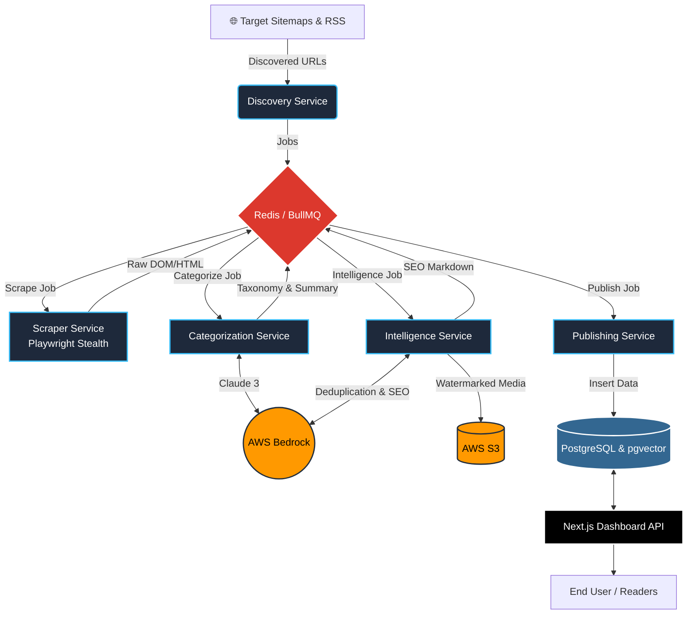

<div align="center">
  
  
  
  
  
  <br/>
  <br/>

  # 🌌 BLOGY: The Autonomous AI News Engine

  **A cybernetic, multi-agent pipeline that hunts, reads, rewrites, and publishes tech news while you sleep.**

  [](https://www.typescriptlang.org/)
  [](https://nextjs.org/)
  [](https://www.prisma.io/)
  [](https://bullmq.io/)
  [](https://aws.amazon.com/bedrock/)

  _Built by Builders, for Builders._

</div>

---

## 🚀 The Vision

Running a high-quality tech publication manually is a relic of the past. **Blogy (LazyFounders)** replaces the traditional editorial room with a tireless, 24/7 AI workforce. 

It autonomously scours the internet for the highest-signal startup and product news, extracts the core value, rewrites the content for flawless SEO, watermarks the media, and deploys it to a sleek, dark-mode Next.js dashboard. **Zero manual intervention required.**

---

## 🧠 The Neural Pipeline

Blogy isn't just a script; it's a deeply orchestrated **microservices architecture** built on Turborepo, where specialized autonomous agents communicate via high-speed Redis queues.



---

## ⚡ Core Systems

### 🕵️ Stealth Scraping Engine
Equipped with `playwright-extra` and stealth plugins, the Scraper Service navigates the modern web undetected. It effortlessly bypasses bot protections to extract the raw, unadulterated HTML signal from the noise.

### 🤖 LLM Categorization & Deduplication
Raw text is fed into **AWS Bedrock (Claude 3)**. The LLM acts as the Editor-in-Chief—summarizing lengthy articles, assigning rigid semantic taxonomy, and cross-referencing our vector database to ruthlessly eliminate duplicate stories.

### ✍️ Generative SEO Rewriting
Once approved, the AI crafts a completely original, engaging, and highly SEO-optimized markdown article. It generates custom meta descriptions, keywords, and semantic HTML structures that search engines love.

### 🎨 Automated Media Processing
No article is complete without visuals. The Intelligence pipeline intercepts raw images, resizes them, applies the custom Blogy SVG watermark using Node.js `sharp`, and securely offloads them to **Amazon S3**.

### 🌌 The Next.js 14 Dashboard
The final stop is the user interface. A blazing-fast, strictly typed Next.js App Router frontend consuming the Prisma database. It features responsive grid layouts, automated fallback images, and perfect Lighthouse scores.

---

## 🏗️ Repository Structure

A masterclass in separation of concerns, powered by **Turborepo**:

```text
lazyfounders/
├── apps/
│   ├── api-dashboard/           # Next.js 14 frontend 
│   ├── discovery-service/       # The URL Hunter
│   ├── scraper-service/         # The Stealth Extractor
│   ├── categorization-service/  # The AI Editor
│   ├── intelligence-service/    # The SEO Writer & Media Processor
│   └── publishing-service/      # The Database Committer
├── packages/
│   ├── database/                # Shared Prisma schema
│   ├── config/                  # Global environment variables
│   ├── logger/                  # Universal Pino logging
│   └── shared/                  # Common Types & Utilities
```

---

## 🛠️ Booting the Engine (Local Dev)

Ready to spin up your own AI workforce?

**1. Prerequisites**
- Node.js >= 20.0.0
- Docker & Docker Compose (for Postgres & Redis)
- AWS CLI configured with Bedrock and S3 access

**2. Environment Configuration**
```bash
cp .env.example .env
```
*(Ensure `DATABASE_URL`, `REDIS_URL`, and AWS credentials are set).*

**3. Install & Sync**
```bash
npm install
npm run db:push -w apps/discovery-service
```

**4. Ignite the Pipeline**
Run the entire microservice cluster concurrently:
```bash
npm run dev:all
```

---

## 🚢 Cloud Deployment

Blogy is architected for the cloud. The included `build-and-push.sh` script containerizes every microservice into highly optimized Docker images.

Deploy seamlessly to **AWS ECS Fargate**, allowing you to independently scale your Scraper workers separately from your LLM Intelligence workers based purely on Redis queue depth.

---
<div align="center">
  <i>"The future of publishing is autonomous."</i>
</div>
